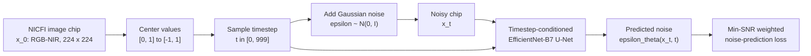
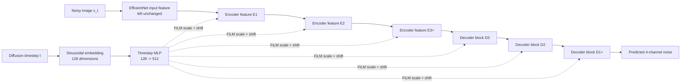
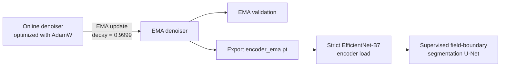
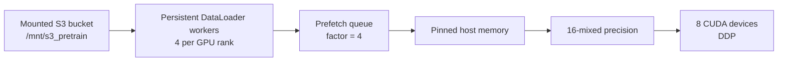

# Overview

The [Mapping Africa](https://mappingafrica.io) project has developed models and data geared towards field boundary mapping in various countries in Africa. The largest of these efforts was through the Lacuna Fund-based project led by [Farmerline](https://farmerline.co/) and collaboration with [Spatial Collective](https://spatialcollective.com/) to develop [A Region-Wide, Multi-Year Set of Field Boundary Labels for Africa](https://github.com/agroimpacts/lacunalabels) (the Lacuna labels), which are now hosted on both the [Registry of Open Data on AWS](https://registry.opendata.aws/africa-field-boundary-labels/) and [Zenodo](https://zenodo.org/records/11060871).

In addition to that dataset, an additional set of \~5000 labels collected through various Mapping Africa project activities are to be made available. These data were combined with the Lacuna labels to train a modified U-Net model (described in [Khallaghi et al, 2025](https://www.mdpi.com/2072-4292/17/3/474)) that has been applied to map several countries, including Zambia, Tanzania, Angola, Ghana, and Nigeria.

The goal of this project is to integrate these datasets and models with the broader [Fields of the World](https://github.com/fieldsoftheworld) project. This integration will revolve around two primary efforts:

1.  Integrate the Lacuna+ labels with the existing FTW labels.
2.  Train and evaluate models using various combinations of the integrated datasets. Models will include the existing Mapping Africa U-Net as well as FTW's U-Net variant, and potentially others.

## Set-up

We require `ftw-tools` to be installed (currently part of [ftw-baselines](https://github.com/fieldsoftheworld/ftw-baselines?tab=readme-ov-file#download-the-ftw-baseline-dataset)), which requires python 3.10-3.12. Using `pyenv` to manage and set up the environment:

``` bash
pyenv install -v 3.12.10
pyenv virtualenv 3.12.10 ftw-mapafrica
pyenv activate ftw-mapafrica
python -m pip install --upgrade pip
```

And then run `pip install -e .` to install the package in editable mode.

## Datasets

We retrieved the Mapping Africa/Lacuna+ labels from our own HPC storage, and the FTW dataset using the FTW cli.

``` bash
ftw download 
ftw data download -o ~/data/labels/cropland/
```

The Mapping Africa/Lacuna+ (hereafter MA) labels were resampled to 256x256. The image bands were re-ordered to RGB-NIR from their existing BGR-NIR order to be consistent with FTW. The 3-class label masks were reprocessed to have a 1-pixel wide field edge class, in keeping with the FTW labels.

A unified CSV catalog was created that provides the following information:

| Variable    | Description                                                                                                                                                                                                                   |
|-------------|-------------------------------------------------------------------------------------------------------------------------------------------------------------------------------------------------------------------------------|
| name        | FTW AOI ID and Lacuna+ grid identifier                                                                                                                                                                                        |
| dataset     | ftw or mappingafrica                                                                                                                                                                                                          |
| version     | 1.0 for FTW; 1.3.0 for labels collected under other Mapping Africa projects; 2.0.0 for labels from Lacuna Fund project                                                                                                        |
| country     | Full names for FTW, abbreviations for MA                                                                                                                                                                                      |
| x           | Longitude in decimal degrees                                                                                                                                                                                                  |
| y           | Latitude in decimal degrees                                                                                                                                                                                                   |
| fld_prop    | Proportion of image covered by field classes (interior + edge)                                                                                                                          |
| nonfld_prop | Proportion of image covered by non-field/background class                                                                                                                               |
| null_prop   | Proportion of image covered by unknown (3) class (FTW only)                                                                                                                             |
| window_a    | Partial path and name for image collected during the local dry season/end of season time period under the FTW scheme. This is the only time image time point available at present for MA.                                     |
| window_b    | Path and name of early growing season image for FTW, not available for MA.                                                                                                              |
| mask        | Path and name of 3-class mask. For FTW, the mask filename (as with image names) is formed from the AOI ID. For MA, the mask file name consists of `<name>*<assignment_id>*<year>-<month>.*` (year/month match window_a image). |
| split       | train, validate, or test                                                                                                                                                                                                      |

The image and mask names have partial paths to each that provide the respective sub-folder structures particular to each dataset, i.e.:

-   For FTW:

    -   images: `ftw/<country>/s2_images/<window_a|window_b>`

    -   masks: `ftw/<country>/label_masks/semantic_3class`

-   MA is simpler: `mappingafrica-256/<images|labels>`

So the two datasets should be downloaded into a single common folder to facilitate their combined use.

To access the MA dataset, download it using the AWS CLI:

``` bash
cd /path/to/your/common/label/directory
aws s3 sync s3://africa-field-boundary-labels/mappingafrica-256/ . --dryrun
aws s3 sync s3://africa-field-boundary-labels/mappingafrica-256/ .
```

If the `--dryrun` variant shows a successful download, run the final line to download the data into the same folder holding the FTW dataset.

## Working with the data

Data classes based on those in `ftw-baselines` and `torchgeo` are used here, with modifications to provide additional augmentations and to read from a combined catalog file. See the [data-modules.ipynb](notebooks/data-modules.ipynb) for additional details.

## Diffusion self-supervised pretraining

The diffusion pipeline pretrains an image encoder without requiring field
boundary labels. It learns to remove synthetic Gaussian noise from satellite
imagery, then exports the pretrained EfficientNet encoder for the supervised
field-boundary mapping task.

The current large-scale experiment is configured in
[`configs/custom/diff-ftw-224-ssl-300ep-es5.yaml`](configs/custom/diff-ftw-224-ssl-300ep-es5.yaml).
It is designed for approximately 30 million four-channel, 224 x 224 NICFI image
chips and an AWS `p3` instance with eight GPUs.

### What the model learns

Each training step starts with a clean image chip `x_0`, samples a random
diffusion timestep `t`, and adds a known amount of Gaussian noise. The model
receives the noisy image `x_t` and the timestep, then predicts the noise that
was added.



The forward diffusion equation is:

```text
x_t = sqrt(alpha_bar_t) * x_0 + sqrt(1 - alpha_bar_t) * epsilon
```

where `epsilon` is sampled Gaussian noise and `alpha_bar_t` comes from the
configured noise schedule. The model minimizes:

```text
loss_i = weight_t * mean((epsilon - epsilon_theta(x_t, t))^2)
```

This is a denoising pretraining objective. The pipeline is not currently used
as an image generator: its useful output is the learned encoder.

### Model architecture

The denoiser is implemented in
[`ftw_ma/diffusion_task.py`](ftw_ma/diffusion_task.py) as
`FTWEfficientNetDiffusionModel`. It wraps a
[`segmentation_models_pytorch`](https://github.com/qubvel-org/segmentation_models.pytorch)
U-Net with an EfficientNet-B7 encoder.

The EfficientNet encoder architecture is intentionally kept unchanged so its
weights can transfer directly into the downstream segmentation U-Net. The
diffusion-specific capability is added around its feature maps through
timestep-conditioned FiLM layers:

```text
FiLM(feature, t) = feature * (1 + scale(t)) + shift(t)
```

The timestep is converted into a sinusoidal embedding, passed through an MLP,
and used to produce a scale and shift for every consumed encoder feature map
and every decoder block.



The first raw input-like encoder feature is deliberately left unconditioned
because the SMP U-Net decoder does not consume it. Creating a trainable FiLM
layer for that discarded feature would leave unused parameters in the DDP
graph.

The default configuration uses:

| Setting | Value | Purpose |
|---------|-------|---------|
| Input channels | `4` | NICFI RGB-NIR imagery |
| Backbone | `efficientnet-b7` | Encoder transferred to field-boundary mapping |
| Denoiser | SMP U-Net | Predicts noise at the original image resolution |
| Diffusion steps | `1000` | Standard discrete diffusion horizon |
| Timestep embedding | `128` dimensions | Sinusoidal representation of `t` |
| Timestep MLP | `512` dimensions | Shared conditioning signal for FiLM layers |
| Noise-prediction loss | MSE | Compares predicted and sampled Gaussian noise |

### Noise schedule and Min-SNR weighting

The scheduler is implemented in
[`diffusion/scheduler.py`](diffusion/scheduler.py). The current run uses a
1000-step IDDPM-style cosine schedule:

```text
noise_schedule: cosine
cosine_s: 0.008
max_beta: 0.999
```

A cosine schedule moves from a nearly clean image to nearly pure noise while
avoiding an overly abrupt corruption path. Inputs are centered from `[0, 1]`
to `[-1, 1]` before noise is added so the image distribution is aligned with
the zero-centered Gaussian noise process.

The loss also uses Min-SNR weighting with `gamma = 5.0`:

```text
SNR_t    = alpha_bar_t / (1 - alpha_bar_t)
weight_t = min(SNR_t, gamma) / SNR_t
```

This prevents easy, very high-SNR examples from dominating the objective while
preserving the harder denoising steps.

### EMA weights, validation, and transfer

Training maintains two copies of the denoiser:

1. The online model is updated by AdamW.
2. The exponential moving average (EMA) model is updated after optimizer steps.

```text
theta_ema = decay * theta_ema + (1 - decay) * theta_online
```

The default EMA decay is `0.9999`. Validation uses the smoother EMA model by
default. At the end of training, the pipeline exports only the EMA
EfficientNet encoder to:

```text
<default_root_dir>/encoder_ema.pt
```



The export format is validated in
[`ftw_ma/checkpoints.py`](ftw_ma/checkpoints.py). The downstream trainer loads
the encoder with `strict=True`, which catches architecture or tensor-shape
mismatches instead of silently dropping weights.

To transfer the pretrained encoder into field-boundary segmentation:

```yaml
model:
  init_args:
    model: unet
    backbone: efficientnet-b7
    in_channels: 4
    weights: /path/to/encoder_ema.pt
```

Validation reports:

- `val/loss`: the EMA denoising loss used by checkpointing and early stopping.
- `val/loss_t_0000_0099` through `val/loss_t_0900_0999`: loss across ten
  timestep bins, which reveals where the model still struggles.
- Diagnostic images for the best validation sample in each epoch: clean input,
  noisy input, true noise, predicted noise, and reconstruction.

### What changed from the first diffusion baseline

The first version was a useful starting point, but it supplied timestep context
only once as an input-channel bias. The current version strengthens the
diffusion mechanics while preserving the downstream encoder.

| Area | First baseline | Current pipeline |
|------|----------------|------------------|
| Encoder | EfficientNet-B7 | EfficientNet-B7, unchanged |
| Timestep context | Added once at the image input | FiLM conditioning at consumed encoder scales and decoder blocks |
| Input range | `[0, 1]` | Centered to `[-1, 1]` |
| Noise schedule | `10,000` linear steps | `1,000` IDDPM-style cosine steps |
| Loss | Uniform noise-prediction MSE | Min-SNR weighted MSE with `gamma = 5.0` |
| Validation model | Online weights | EMA weights |
| Validation detail | Aggregate loss | Aggregate loss plus ten timestep bins |
| Transfer artifact | Full training checkpoint focus | Strict EMA encoder export |
| AWS configuration | Two GPUs | Eight GPUs, AMP, and loader throughput controls |

### Pretraining data catalog

The current AWS configuration expects:

```text
data_dir: /mnt/s3_pretrain
catalog:  /mnt/s3_pretrain/catalog_train_validate_80_20.csv
```

The catalog contains a `usage` column with `train` and `validate` values. The
current temporary split is a reproducible random 80/20 division of the
29,258,844-chip catalog:

| Split | Chips |
|-------|------:|
| Train | 23,408,306 |
| Validate | 5,850,538 |
| Total | 29,258,844 |

The large random validation split is useful for bringing up the pipeline and
measuring denoising behavior. For a final scientific comparison, prefer a
geography-aware holdout when tile or region metadata is available: neighboring
satellite chips can otherwise place very similar imagery in both splits.

The generated catalog is a data artifact and should not be committed to Git.
Upload it to the mounted bucket so it appears at the configured
`/mnt/s3_pretrain/catalog_train_validate_80_20.csv` path on the AWS instance.

Validating all 5,850,538 holdout chips after every epoch is also expensive.
Use `--trainer.limit_val_batches=20` for the short benchmark. Before the full
run, choose the validation policy intentionally: scan the complete holdout,
validate a stable subset, or replace the temporary split with a smaller
geography-aware holdout.

### AWS data loading and DDP

The large pretraining run reads many small image chips from mounted S3 storage.
The current first-tier throughput settings are implemented in
[`ftw_ma/ssl_datamodule.py`](ftw_ma/ssl_datamodule.py) and the experiment YAML:



| Setting | Value | Reason |
|---------|-------|--------|
| `devices` | `[0, 1, 2, 3, 4, 5, 6, 7]` | Use all eight GPUs |
| `strategy` | `ddp_find_unused_parameters_false` | Avoid the DDP unused-parameter scan after verifying the graph |
| `precision` | `16-mixed` | Reduce GPU memory use and increase tensor throughput |
| `num_workers` | `4` per rank | Read chips concurrently |
| `persistent_workers` | Enabled automatically | Reuse worker processes between epochs |
| `prefetch_factor` | `4` | Prepare upcoming batches |
| `pin_memory` | `true` | Improve host-to-GPU transfer |
| `drop_last_train` | `true` | Keep distributed training batches regular |

For multi-GPU pretraining, use
[`run_lightning_fit.py`](run_lightning_fit.py). This standalone Lightning
launcher ensures that every DDP child process relaunches the same valid command.
It also applies GDAL environment settings that reduce unnecessary remote
directory reads and increase the VSI cache.

The S3 mount may still remain the limiting factor. Measure throughput with a
short benchmark before starting a full run. If GPU utilization stays low,
stage image shards on local NVMe or EBS and compare images per second.

### Running diffusion pretraining

First run a short eight-GPU benchmark:

```bash
python run_lightning_fit.py fit \
  -c configs/custom/diff-ftw-224-ssl-300ep-es5.yaml \
  --trainer.limit_train_batches=1000 \
  --trainer.limit_val_batches=20 \
  --trainer.max_epochs=1
```

A healthy benchmark should:

- Initialize all eight DDP ranks.
- Report a first-batch value range close to `(-1.0000, 1.0000)`.
- Select non-zero `train` and `validate` sample counts.
- Advance beyond batch `0`.
- Report stable loss values while GPU utilization is monitored.

After the benchmark passes, start the full configured run:

```bash
python run_lightning_fit.py fit \
  -c configs/custom/diff-ftw-224-ssl-300ep-es5.yaml
```

To resume diffusion pretraining:

```bash
python run_lightning_fit.py fit \
  -c configs/custom/diff-ftw-224-ssl-300ep-es5.yaml \
  --ckpt_path /path/to/checkpoint.ckpt
```

### Relevant diffusion files

| File | Role |
|------|------|
| [`ftw_ma/diffusion_task.py`](ftw_ma/diffusion_task.py) | Denoiser, FiLM conditioning, weighted training objective, EMA validation, diagnostics, and encoder export |
| [`diffusion/scheduler.py`](diffusion/scheduler.py) | Cosine schedule, forward noising process, timestep embeddings, SNR calculation, and Min-SNR weights |
| [`ftw_ma/ssl_datamodule.py`](ftw_ma/ssl_datamodule.py) | Image-only SSL dataset and DataLoader throughput settings |
| [`ftw_ma/checkpoints.py`](ftw_ma/checkpoints.py) | Strict encoder-export checkpoint format |
| [`run_lightning_fit.py`](run_lightning_fit.py) | Standalone Lightning DDP launcher |
| [`tests/test_diffusion_pipeline.py`](tests/test_diffusion_pipeline.py) | Schedule, weighting, transfer, forward-pass, and no-unused-parameter regression tests |

## Supervised training and evaluation

From the CLI, the model can be trained as follows:

```bash
ftw_ma model fit -c configs/<config-file>.yaml
```

See the [example config](configs/initial/example-config.yaml) for settings.

`<config-file>.yaml` should be named to be informative of the experiment, e.g. `fullcat-ftwbaseline-exp2.yaml` for the second experiment using the full combined catalog and FTW Baseline model.

To resume training from a specific checkpoint:

```bash
CKPT=/path/to/checkpoint/checkpoint.ckpt
ftw_ma model fit -c configs/<config-file>.yaml --ckpt_path $CKPT
```

To test the model:

```bash
CHKPT=/path/to/checkpoint/checkpoint.ckpt 
ftw_ma model test -c configs/config.yaml -m $CHKPT --gpu 0 -o metrics.json
```

Or run the `tester.sh` script:

```bash
# from project root
./scripts/tester.sh <model_dir_name> <version_number> <catalog>
```

`<model_dir_name>` is the name of the model directory under `~/working/models/`, e.g. `fullcat-ftwbaseline-exp2` where the model checkpoint is stored. `<version_number>` is the version number of the training run, specified explicitly as an integer, or if left empty the latest version is found and run. `<catalog>` is the path to the catalog CSV file.

This will produce an output metrics file in a specified directory, with a file name composed of the experiment name and catalog used in testing. The script is currently hard-coded for the validation split.
